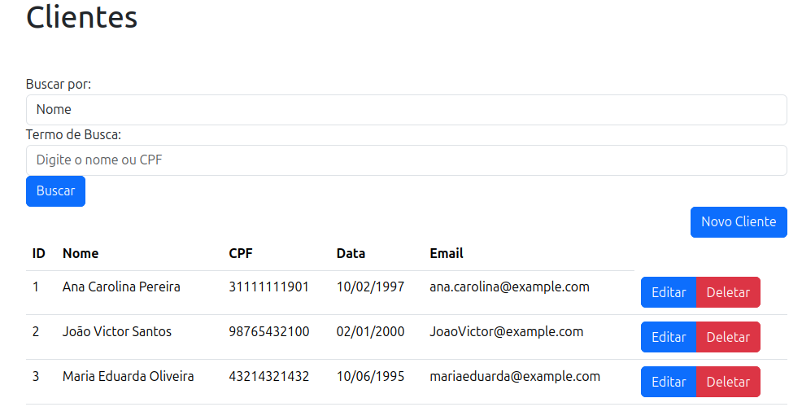
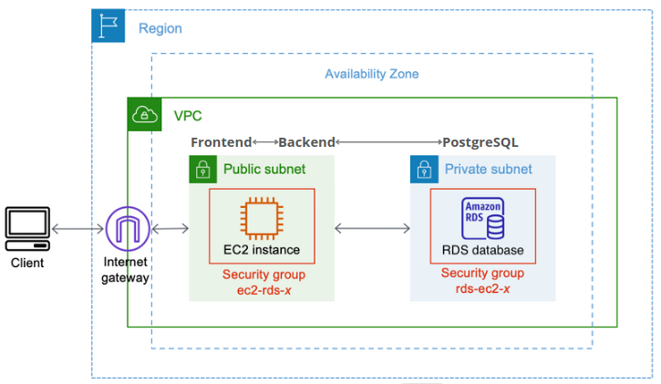

## GCC180 – Computação em Nuvem - Trabalho Final: Sistema de Gerenciamento de Clientes

Este projeto faz parte do trabalho final da disciplina GCC180 – Computação em Nuvem e consiste em um sistema CRUD para o gerenciamento de clientes de uma empresa. O sistema foi implantado na Amazon Web Services (AWS), utilizando recursos como VPC, EC2 e RDS.

## Índice
- [Home](#home)
- [Infraestrutura em Nuvem (AWS)](#infraestrutura-em-nuvem-aws)
- [Funcionalidades](#funcionalidades)
- [Tecnologias Utilizadas](#tecnologias-utilizadas)
- [Licença](#licença)

## Home

## Infraestrutura em Nuvem (AWS)

Amazon Web Services (AWS)

- EC2
- RDS (PostgreSQL)
- VPC (Subredes públicas e privadas)
- API Gateway
- Security Groups

## Funcionalidades

O sistema permite:

- Cadastrar novos clientes
- Alterar dados de clientes existentes
- Excluir clientes
- Buscar clientes por nome e/ou CPF
- Listar todos os clientes cadastrados

Campos do Cliente:

- Nome
- CPF
- Data de nascimento
- E-mail

## Tecnologias Utilizadas

**backend**:
- Java 21
- Spring Boot 3
- Maven

**frontend**:
- Angular 17
- Bootstrap 5

**Containerização e Orquestração**
- Docker

**AWS**
- EC2
- Amazon RDS(PostgreSQL)
- VPC
- API Gateway
- Security Groups

## Licença

Este projeto está licenciado sob a licença MIT. Veja o arquivo [LICENSE](LICENSE) para mais detalhes.
